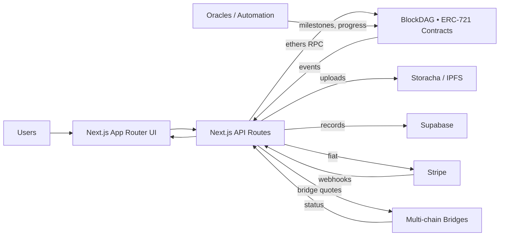

# PatriotPledge NFTs

A modern Next.js + Tailwind CSS scaffold for an NFT-powered fundraising platform built on BlockDAG testnet (RPC: https://rpc.awakening.bdagscan.com) for the nonprofit vetshelpingvets.life. Designed with an empathetic, patriotic theme and multilingual placeholders.

## Problem
Traditional charity can feel impersonal and opaque. Donors want choice, transparency, and a connection to the people they help.

## Solution
Dynamic NFTs for fundraisers where donors choose stories/causes. Funds route directly to creators with an auditable 1% nonprofit fee. Stories are readable and updatable; NFTs evolve with progress.

## Market
18M+ U.S. veterans plus families, donors, corporates, patriots, and global users. Expandable beyond veterans to any cause (disasters, children’s issues, personal fundraisers).

## Key Features (Scaffolded)
- User roles: creators (veterans/families/non‑veterans), donors, admins.
- Pages: Home, Submit Story, Marketplace, Dashboard, Admin, Story Viewer.
- Dynamic NFTs: updatable `tokenURI`, progress, images, events (Solidity scaffold).
- Storage: Storacha/IPFS placeholders with UCAN delegation hooks.
- Payments: Stripe helper and crypto via ethers placeholders. 1% fee concept.
- Receipts: PDF generation route scaffold.
- Database: Supabase client placeholder for stories, hidden lists, etc.
- Multilingual: `locales/en` and `i18n.ts` for easy additions.

## Architecture (High-Level)
- Frontend (Next.js App Router + Tailwind)
- Contracts (Solidity ERC‑721 on BlockDAG testnet)
- Storage (Storacha/IPFS with gateway fallbacks)
- Off‑chain DB (Supabase/Neon)
- Payments (Stripe + crypto bridges/oracles placeholders)
- Oracles (placeholders for future automation)

### Mermaid Diagram

## Tech Stack
- Next.js 14 (App Router), React 18, TypeScript
- Tailwind CSS
- Ethers v6, Stripe, pdf-lib
- Supabase client

## Getting Started
1. Copy envs
   - `cp .env.example .env.local` (Windows: manually duplicate file)
   - Fill values: `BLOCKDAG_RPC`, `CONTRACT_ADDRESS`, `ADMIN_SECRET`, `STRIPE_KEY`, Storacha DIDs, Supabase keys.
2. Install dependencies
   - npm install
   - Recommended dev types: `npm i -D @types/node`
3. Run the dev server
   - `npm run dev` then open http://localhost:3000

## E2E Testing (Playwright)
- Install browsers: `npm run playwright:install`
- Run tests: `npm run test:e2e`

## Environment Variables
- BLOCKDAG_RPC (default included testnet RPC)
- CONTRACT_ADDRESS (deployed ERC‑721 address on BlockDAG)
- STORACHA_SPACE_DID, STORACHA_DELEGATION_CAR_PATH
- ADMIN_SECRET
- STRIPE_KEY
- NEXT_PUBLIC_SUPABASE_URL, NEXT_PUBLIC_SUPABASE_ANON_KEY

## Notes
- Upload/mint/purchase routes are placeholders with error handling and logging.
- Admin panel uses a secret for simple auth. Expand as needed.
- Wallet connect via MetaMask; add bridges/oracles as integrations later.
- Tailwind theme uses dark blues, grays with red/white accents for accessibility and empathy.

## Roadmap Ideas
- Add real Storacha client and UCAN delegation flow
- Integrate Stripe checkout and liquidity conversion hooks
- Implement milestone release smart contract logic and fee splitters
- Add comments/sharing, AI summaries, and moderation tools
- Expand i18n to additional languages
